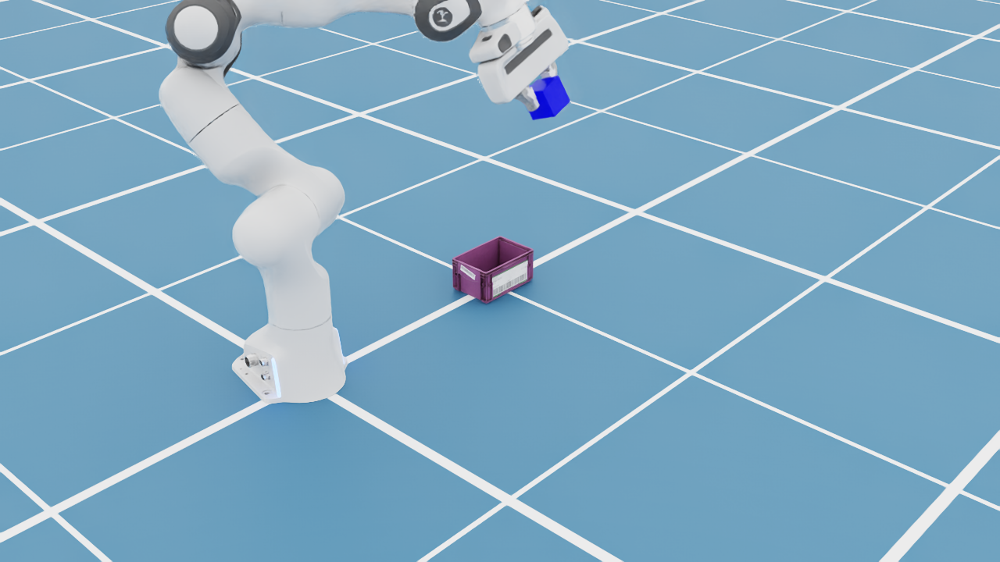
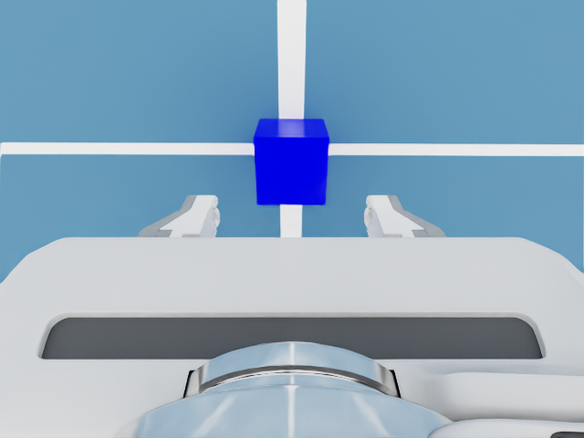
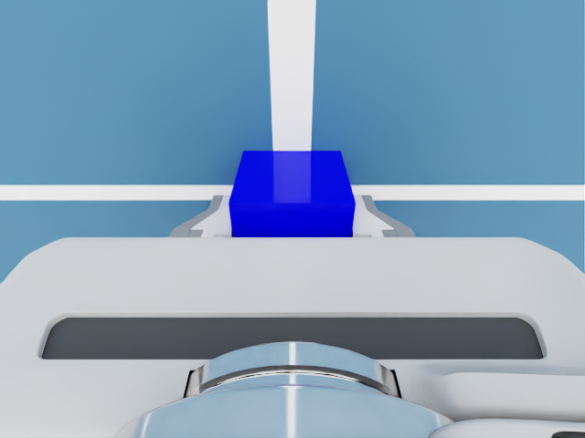
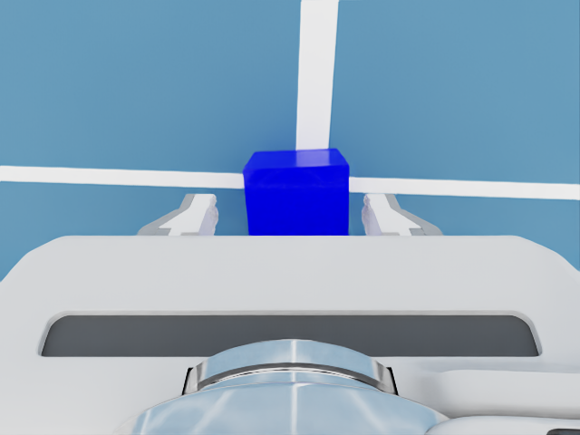
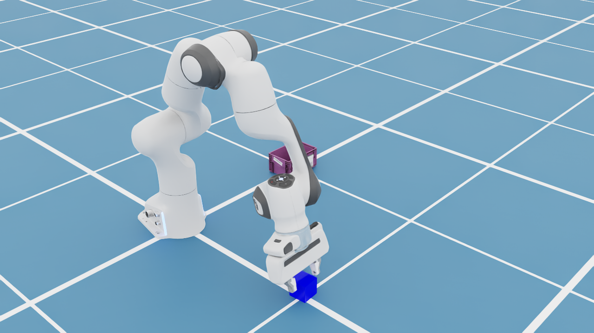

# Project Plan: iPhone-ARKit Teleoperation of a Franka in Isaac Sim (ROS2 PoC)

> **Phase 1 = Proof of Concept.** No LeRobot, no VLA, no imitation learning, no
> tactile sensing yet. The single goal of this phase is: a **stock Franka Panda**
> in a small **pick-and-place scene** (cube + bin) with a **wrist-mounted
> camera**, running in **Isaac Sim 6.0 on native Ubuntu**, controllable in real
> time from an **iPhone via ARKit** over **ROS2 + Pinocchio**, with **all
> telemetry verified to flow correctly**.

---

## 1. Problem Statement

### 1.1 Objective
Stand up a real-time teleoperation loop where a person waves their **iPhone** in
the air and a **simulated Franka Emika Panda** in **NVIDIA Isaac Sim 6.0** mirrors
the motion well enough to **pick up a small cube and drop it into a small bin**,
while **joint/proprioceptive data** and **wrist-camera frames** are published and
observed correctly over **ROS2**.

[SpesRobotics/teleop](https://github.com/SpesRobotics/teleop) maps a phone pose to
end-effector motion (Pinocchio servo-IK) and publishes over ROS2, but it's built
on the **WebXR API, which iPhones do not support**, and its ROS layer
(`JacobiRobotROS`) hardcodes conventions (JointTrajectory, `/robot_description`)
that don't fit our bridge. So rather than depend on it, we **write our own small
`teleop_arkit` ROS2 package** (IK node + ARKit receiver) and only **reuse its
Pinocchio servo-IK *technique*** (damped least-squares + singularity-adaptive
damping), cribbed from its `JacobiRobot`. teleop stays a gitignored reference in
`third_party/`. This project's core contribution is the **ARKit** input path so an
iPhone can drive the robot.

### 1.2 Why this is the right first slice
- It exercises the full sensorimotor loop (input → control → sim → perception →
  feedback) without the complexity of learning.
- It produces a working data pipeline (joint + camera + pose topics) that a later
  imitation-learning phase can record from directly.
- It de-risks the genuinely hard integration point early: **ARKit → robot pose**.
- The pick-and-place is **teleop-driven** — the human does it by moving the phone;
  there is no autonomous planner. The cube and bin are the task scene.

### 1.3 Non-goals (explicitly out of scope this phase)
- No LeRobot / Hugging Face dataset format.
- No ACT / VLA / any policy or training.
- No tactile sensing (no Robotiq 2F-85, no TSF-85, no contact sensors).
- No sim-to-real, no real robot.

> **Changed 2026-06-07:** Phase 1 was **simplified back to the stock Franka** with
> its default parallel-jaw hand plus a cube/bin task scene and a wrist camera.
> The earlier custom **Robotiq 2F-85 + CoRo TSF-85 deformable-tactile gripper**
> plan was **dropped** — it pulled the hardest work (binary-USD rigging, GPU
> deformables, ONNX inference) into Phase 1 for a capability this PoC doesn't
> need. Removing tactile also removed the only reason we were pinned to Isaac
> Sim 5.1, so we run **Isaac Sim 6.0** (latest).

---

## 2. Platform & History

**Platform: a single native Ubuntu 26.04 machine** (dual-booted alongside
Windows). Everything — Isaac Sim, ROS2, teleop, the ARKit receiver — runs on the
one Linux box. The iPhone connects over WiFi.

> **Why we left Windows:** the first attempt ran Isaac Sim on Windows 11 with the
> ROS2 side in WSL2. Isaac Sim installed and booted fine, but the RTX renderer
> crashed on init (access violation in `omni.hydra.rtx` / `rtx.scenedb`) because
> the laptop's Blackwell RTX 5060 ran a 2026 NVIDIA driver (610.47) far newer
> than Isaac Sim's validated Windows driver. Going native Linux (a) lets us pin an
> exact validated NVIDIA driver, (b) makes Isaac Sim run on its best-supported OS,
> (c) makes ROS2 native, and (d) deletes the fragile Windows↔WSL2 DDS boundary.

> **26.04 caveat:** Isaac Sim 6.0 officially validates Ubuntu **22.04 / 24.04**,
> not 26.04. We're on 26.04 by choice; the main residual risk is Isaac Sim's
> binaries (built against older glibc) on 26.04's newer glibc. ROS2 is **not** a
> risk here because we get it from **RoboStack** (conda), decoupled from the host
> Ubuntu version.

> **Run model — standalone binary, not pip:** we run Isaac Sim from the
> downloaded **6.0 standalone binary** (`isaac-sim-standalone-6.0.0-linux-x86_64`),
> which bundles its own Python and every extension. The install lives outside the
> repo at `~/isaac-sim/6.0.0` and is surfaced as the gitignored symlink
> `.isaac-sim` at the project root; everything launches via
> `scripts/run_isaac.sh`. This **replaced the `isaacsim` pip package** (and all
> its uv resolve gotchas). **pixi** is now reserved for the ROS2 env (Phase 3).

---

## 3. Architecture

```
                 iPhone (ARKit 6-DoF device pose + touch)
                          │  WiFi: UDP/JSON (ZIG SIM PRO), ~10 Hz
                          ▼
┌─────────────────────────────────────────────────────────────────────────┐
│ ONE UBUNTU 26.04 MACHINE (NVIDIA RTX, validated Linux driver)           │
│                                                                         │
│  pixi env "ros" (RoboStack ROS2 Jazzy + Pinocchio + our teleop_arkit)   │
│  ┌───────────────────────────────────────────────────────────────┐      │
│  │ arkit_receiver.py   (our code)                                │      │
│  │   ZIG SIM ARKit + touch  ->  relative EE pose                 │      │
│  │   (axis remap, clutch, scaling, 6-DoF orientation)            │      │
│  │     ->  /target_frame  +  /gripper_command                    │      │
│  │                    │                                          │      │
│  │                    ▼                                          │      │
│  │ joint_command_node.py   (our code)                            │      │
│  │   /target_frame + /gripper_command  ->  Pinocchio servo-IK    │      │
│  │   (CartesianServoIK, EE = panda_hand_tcp)  ->  /joint_command │      │
│  └───────────────────────────────────────────────────────────────┘      │
│        ▲  /joint_states  /wrist_cam/*  /scene_cam/*  /tf  /clock        │
│        │  ROS2 DDS over localhost (same machine — trivial)              │
│        ▼  /joint_command   (7 arm + 2 finger JointState)                │
│  Isaac Sim 6.0 STANDALONE BINARY  (.isaac-sim, bundled Python)          │
│  ┌────────────────────────────────────────────────────────────────────┐ │
│  │ • Stock Franka Panda (default parallel-jaw hand, one articulation) │ │
│  │ • Small cube (~5 cm) + small bin (scaled-down KLT)                 │ │
│  │ • Wrist RGB camera on panda_hand + fixed scene RGB camera          │ │
│  │ • isaacsim.ros2.bridge (OmniGraph action graph)                    │ │
│  │     publishes: /joint_states /clock /tf /wrist_cam/* /scene_cam/*  │ │
│  │     subscribes: /joint_command  ->  ArticulationController         │ │
│  └────────────────────────────────────────────────────────────────────┘ │
└─────────────────────────────────────────────────────────────────────────┘
```

**Sim from the binary, tooling from pixi.** Isaac Sim (+ its ROS2 bridge) runs in
the standalone binary's self-contained Python; the RoboStack ROS2 stack (+ Pinocchio
+ our `teleop_arkit` package) runs in a pixi conda env. They talk over **localhost
DDS** — the ordinary ROS2 multi-process pattern, with none of the WSL2 networking
pain. Match `ROS_DOMAIN_ID` and the RMW between Isaac Sim's bridge and the RoboStack
Jazzy env. Only `/joint_command` (the IK output) crosses into Isaac; `/target_frame`
and `/gripper_command` stay inside the `ros` env.

**Key design choice:** all ARKit-specific work is isolated in one adapter
(`arkit_receiver.py`), which emits a generic `/target_frame` (`geometry_msgs/PoseStamped`)
+ `/gripper_command`. Everything downstream — the Pinocchio servo-IK node and the Isaac
side — is input-agnostic, so swapping the phone for another pose source touches only the
adapter.

---

## 4. Tech Stack & Decisions

| Concern              | Decision                                                            |
| -------------------- | ------------------------------------------------------------------- |
| OS                   | **Ubuntu 26.04** (single machine; dual-boot with Windows)          |
| Simulator            | Isaac Sim **6.0** — **standalone binary** (bundled Python), `.isaac-sim` symlink |
| Env / package mgr    | **pixi** for the `ros` env (Phase 3) + convenience tasks; sim runs from the binary |
| Robot                | Franka Emika Panda — **stock** Isaac asset                          |
| Gripper              | **Stock Panda parallel-jaw hand** (AlternateFinger; 80 mm opening)  |
| Task scene           | Small **cube** (~51.5 mm) + small **bin** (KLT scaled 0.5×)         |
| Perception           | **Wrist RGB camera** on `panda_hand` + **fixed scene RGB camera**    |
| Control middleware   | **ROS2 Jazzy** via **RoboStack** (conda; host-OS-independent)       |
| Teleop adapter       | **our `teleop_arkit` pkg** (own IK node + ARKit receiver); teleop = reference only |
| Phone input          | **ARKit** pose via an off-the-shelf streamer app (e.g. ZIG SIM)     |
| IK                   | **Pinocchio** servo-IK (our node; technique cribbed from teleop's `JacobiRobot`). Franka model from `example-robot-data`; EE = the URDF's `panda_hand_tcp` frame (≈ the measured `tcp_offset.yaml`). Isaac does no IK |
| Robot model          | `example-robot-data` Panda URDF + meshes (Pinocchio IK + rviz2)     |
| NVIDIA driver        | Linux **580.95.05 or later** (validated for 6.0)                    |

---

## 5. Phased Step Plan

Checkboxes track progress; **Phases 0–6 are done — the PoC goal is met and the
end-to-end data-verification pass is complete.**

### Phase 0 — Prerequisites (Ubuntu)
- [x] Boot Ubuntu 26.04; NVIDIA driver ≥ 580.95.05 (`nvidia-smi`).
- [x] Install `pixi`; get the project onto the Linux filesystem (see README).
- [x] Download the **Isaac Sim 6.0 standalone binary**, place it at
      `~/isaac-sim/6.0.0`, and symlink it as `.isaac-sim` in the repo.

### Phase 1 — Franka pick-and-place scene (cube + bin + wrist camera)

> **End state:** one Isaac Sim 6.0 scene with a stock Franka Panda, a ~5 cm cube,
> a small bin, and a wrist RGB camera. A standalone script proves the cube is
> graspable, the cube is released into the bin, and the camera renders frames —
> while joint positions print every step. This is the foundation the ROS2 bridge
> and ARKit teleop layer onto in Phases 2–5.
>
> Reference: NVIDIA's shipped `FrankaPickPlace` example
> (`.isaac-sim/standalone_examples/api/isaacsim.robot.experimental.manipulators/franka/pick_place.py`)
> uses a 51.5 mm cube and the stock gripper (80 mm opening, ~28 mm clearance) and
> drives the arm with **differential IK (no cuRobo)** — we reuse it and add the
> bin + camera.
>
> **The autonomous `FrankaPickPlace` motion (+ its differential IK) is a
> temporary self-test**, kept only to verify the scene is physically sane (cube
> graspable, lands in bin, camera renders) before the control stack exists. It is
> **deleted once the ROS2 bridge takes over in Phase 2** — teleop drives the
> joints via Pinocchio IK in the ROS env; Isaac Sim does no IK. (Reuse is the
> *scene/assets*, not the controller.)

- [x] **1.0** Adopt the binary run model: drop the `isaacsim` pip pin from
      `pixi.toml`; run via `scripts/run_isaac.sh` (`.isaac-sim` symlink).
- [x] **1.1** **Smoke-test the binary.** RTX renderer initializes on the
      validated Linux driver (595.71.05) with the AMD iGPU correctly skipped —
      no Windows-era crash. Asset library streams from the cloud root on run.
- [x] **1.2** **Build + run the scene.** `isaac/load_franka_pickplace.py`
      (`pixi run franka` / `scripts/run_isaac.sh`): boots the binary, assembles
      stock Franka + 5 cm cube + scaled-down KLT bin + wrist camera, runs
      NVIDIA's `FrankaPickPlace` retargeted to release **into the bin**. Verified:
      grasp → lift → move → drop in bin over 3 cycles; joints stream each step.
- [x] **1.3** **Confirm bin fit + proportions.** Bin world bbox
      min≈(-0.049, 0.426, -0.017) max≈(0.05, 0.574, 0.056) → center ≈ (0, 0.5),
      ~0.10×0.15×0.073 m at 0.5×; cube drops in cleanly when released above the
      true bbox center (rim_top + 0.14). Loader computes this at runtime.
- [x] **1.4** **Confirm the cameras.** Two cameras, both verified from saved
      frames: a **wrist cam** (640×480, parented to `panda_hand`, cube centered
      through approach + grasp) and a **fixed scene cam** (1280×720, front-right
      3/4 view capturing the whole rig + cube + bin). Key gotchas (now handled in
      the `make_camera` helper): the `Camera` ctor pose is WORLD (we bake a LOCAL
      transform on the prim instead); USD's default 1.0 m near-clip blanks a
      close-up cam (set to 0.01 m); approach axis is panda_hand local +Z; fingers
      open along local Y. Frames saved to `outputs/` for inspection.
- [x] **1.5** **Record the TCP offset.** The loader measures the grasp point from
      the live scene (cube center while grasped, expressed in `panda_hand` local
      frame) and writes `config/tcp_offset.yaml`. Measured **[0.003, 0.001,
      0.1095] m** — X/Y ≈ 0 (centered), Z within ~6 mm of Franka's canonical
      0.1034 m. Phase 4 sets the Pinocchio IK EE = `panda_hand` + this offset.

#### Phase 1 verification — captured frames

Frames rendered by `isaac/load_franka_pickplace.py` during a run (the source
PNGs land in the gitignored `outputs/`; these copies live in `docs/images/`).

**Scene cam** — whole rig + cube + bin (here: carrying the cube to the bin):



**Wrist cam** — approach (cube centered, fingers in view) and grasp:




### Phase 2 — ROS2 bridge on the Isaac Sim side
- [x] **2.1 (publishers)** `isaacsim.ros2.bridge` + a `/ROS2Graph` action graph
      (`_build_ros2_graph` in the loader, behind `--ros`) publishing `/clock`,
      `/joint_states` (9 DOF incl. fingers), `/tf`, and both cameras
      (`/{wrist,scene}_cam/image_raw` + `/camera_info`). Node types from the
      binary's own `moveit.py` / `camera_periodic.py`. Gotchas solved: on Ubuntu
      26.04 the bridge can't auto-pick a distro — `run_isaac.sh` exports
      `ROS_DISTRO=jazzy` / `RMW_IMPLEMENTATION=rmw_fastrtps_cpp` / internal-libs
      `LD_LIBRARY_PATH` before boot; camera_info uses `ROS2CameraInfoHelper`
      (not `ROS2CameraHelper type=camera_info`); TF via `targetPrims` works but
      logs a deprecation (upgrade to `IsaacComputeTransformTree` later).
- [x] **2.1 (control)** `--control ros` adds `ROS2SubscribeJointState` →
      `IsaacArticulationController`: the arm follows `/joint_command` (verified —
      publishing a JointState moves the arm and `/joint_states` reflects it). The
      autonomous self-test is **kept as `--control auto`** (default; handy scene
      check + hosts the TCP-offset measurement), not retired. Phase 4 feeds
      `/joint_command` from Pinocchio IK in the ROS env.
- [x] **2.2** Verified from the RoboStack side: `ros2 topic list` shows all 7
      topics; `/joint_states` echoes live values.

### Phase 3 — ROS2 environment (RoboStack)
- [x] **3.1** Added a `ros` pixi env (RoboStack ROS2 Jazzy `ros-base` +
      `rmw-fastrtps-cpp`, isolated via `no-default-feature`). Pinocchio + example-robot-data
      added in Phase 4. Use: `pixi run -e ros …`.
- [x] **3.2** **DDS interop confirmed** — the Isaac binary (internal-Jazzy
      FastDDS) and the RoboStack env (Jazzy FastDDS) discover each other over
      localhost on `ROS_DOMAIN_ID=0` with `rmw_fastrtps_cpp` on both; all bridge
      topics are visible/echoable cross-process. No discovery tweak needed.

### Phase 4 — our `teleop_arkit` package: Pinocchio servo-IK → `/joint_command`
> Decision (2026-06-08): don't depend on `teleop` (we'd use ~1 class and inherit
> WebXR/JointTrajectory baggage). Build our own pkg; reuse only the servo-IK
> *technique* (B2). Validate phone-free with scripted target poses; ARKit input
> is Phase 5.
- [x] **4.0** Added `pinocchio` + `example-robot-data` to the `ros` env. Panda
      loads in Pinocchio (nq=9; joint names match Isaac's `panda_joint1..7` +
      fingers). URDF: `…/example-robot-data/robots/panda_description/urdf/panda.urdf`
      (loaded by path — the conda build ships data, not the python loader). It has
      a **`panda_hand_tcp`** frame (canonical 0.1034 m ≈ our measured 0.1095 m), so
      we use it directly as the EE — no `addFrame` needed.
- [x] **4.1** `teleop_arkit/robot_state_pub.py` (`pixi run -e ros robot-model`)
      publishes the Panda URDF on `/robot_description` (latched) + `/tf` via
      `robot_state_publisher` → rviz2 `RobotModel` shows the solid Franka tracking
      `/joint_states`. **Verified live.** The mesh wrinkle is solved by rewriting
      `package://example-robot-data/…` → absolute `file://$CONDA_PREFIX/share/…`.
- [x] **4.2** `teleop_arkit/ik.py` — compact Pinocchio DLS Cartesian servo (own
      code; singularity-adaptive damping cribbed from `JacobiRobot`), EE =
      `panda_hand_tcp`. Unit-tested standalone: +10 cm x/z target reached in 250
      steps, 0.97 mm error.
- [x] **4.3** `teleop_arkit/joint_command_node.py` — seeds from `/joint_states`,
      servos to a target, publishes `/joint_command` (7 arm + 2 finger). **Verified
      phone-free**: `pixi run -e ros ik-demo` drives the sim arm through the demo
      poses with gripper toggle (target pose → Pinocchio IK → `/joint_command` →
      arm). Demo poses are offsets from the start EE (not the cube), so it exercises
      the loop rather than picking. `--source topic` (/target_frame) ready for
      Phase 5. *(Gotcha: 8 GB GPU OOMs if other apps hold VRAM — free it or use
      `--headless`.)*

### Phase 5 — ARKit input adapter
- [x] **5.1** ZIG SIM PRO format captured (UDP/JSON):
      `sensordata.arkit.position` = [x,y,z] (m), `…rotation` = [x,y,z,w]; ~10 Hz.
      Sniffer = `teleop_arkit/sniff_stream.py`.
- [x] **5.2 (position teleop)** `teleop_arkit/arkit_receiver.py`: ZIG SIM ARKit →
      relative motion → `/target_frame` (consumed by `ik-topic`). **Verified live**:
      phone translation drives the EE, directions correct (up→+Z, fwd→+X, left→+Y),
      `--scale` gain. Made **event-driven** (publish per packet) and the IK servo
      snappier (`--kp-lin`/`--rate` exposed; lag ≈ 1/kp_lin) — latency tuned to
      feel good. Orientation kept fixed (downward) in this cut.
- [x] **5.2 (clutch + gripper)** ZIG SIM `touch` count drives control: 1 finger =
      Move (clutch, re-zeros on engage so no jump), 0 = freeze, 2-finger tap =
      toggle gripper (latched). Receiver publishes `/gripper_command` (Float64);
      IK node applies it. **Verified live.**
- [x] **5.2 (6-DoF orientation)** EE orientation driven from `arkit.rotation`
      (quat order `xyzw`), relative to the clutch-engage reference, remapped to the
      robot base by `C·(R_now·R_refᵀ)·Cᵀ`. **Verified live** — yaw/pitch/roll all
      track. Toggle with `--no-orient`; quat order via `--quat-order`.
- [~] **5.3** Latency tuned (event-driven + servo gains). Device→robot frame
      calibration / smoothing: good enough; revisit if needed.

### Phase 6 — End-to-end & data verification
- [x] **iPhone teleop pick-and-place WORKS** — move (1 finger) → pinch (2-finger
      tap) to grip → carry → release into the bin. Grasp holds after binding a
      high-friction physics material to cube + fingertips (μs=1.4).
- [x] **§6 data-verification pass done (2026-06-08)** — one 89 s rosbag
      (`outputs/phase6_e2e`, light topics only) over a live iPhone pick-and-place
      confirms all four checks together: `/joint_states` 9 DOF at sim rate;
      `/target_frame` swept ~0.75×0.89×0.89 m and `/joint_states` followed (max joint
      Δ 2.94 rad); `/gripper_command` clean close+open; cube centred between the
      fingers at grasp (wrist cam, saved to `outputs/phase6_grasp*`).

#### Phase 6 verification — captured frames

Frames saved on the gripper-close edge during the live iPhone teleop pass (source
PNGs land in the gitignored `outputs/`; these copies live in `docs/images/`).

**Wrist cam** — the cube centered between the fingers at grasp:



**Scene cam** — whole rig: the Franka reaching down to grasp the cube:



### Phase 7 — Imitation-learning data collection (Rerun `.rrd`) → custom VLA  ◀ IN PROGRESS
Full plan + locked decisions: `.claude/plans/now-lets-talk-about-moonlit-rivest.md`.
- [x] **7.1** Per-episode reset + cube randomization (`/episode/reset`); IK homes (`HOME_ARM_Q`) then re-seeds.
- [x] **7.2** `rerun-sdk==0.33.0` in the `ros` env (record side).
- [x] **7.3** `teleop_arkit/record_rrd.py` — per-episode `.rrd` recorder (keys + `/record/command`, `--view`). 3 success demos in `~/rerun_episodes/`.
- [x] **7.4** `rrd_dataset.py` + `compute_stats.py` — read `.rrd` via the 0.33 **chunk API** (`RrdReader().store().stream().to_chunks()`), latest-at align on `log_time`, action-chunk, JPEG decode. Verified (740 samples, decode 379/s). *(torch + `rerun[catalog]` merged into the `ros` env — no separate `train` env.)*
- [~] **7.5** Compact ACT (`models/act_min.py`, 11.6 M) + `train.py` **DONE** → overfit one episode drove L1 0.57→0.066 (**data validated**); `infer_node.py` + closed-loop next.
- [ ] **7.6** Scale demos; then the Gemma-based VLA (`models/gemma_vla.py`) on bigger hardware.

---

## 6. "Getting the data correctly" — verification checklist
- **Proprioception:** `/joint_states` updates at sim rate with sane joint
  names/positions/velocities (incl. the gripper finger joints).
- **Perception:** `/wrist_cam/image_raw` + `/scene_cam/image_raw` stream frames at
  the expected resolution; the cube is visible during grasp.
- **Pose target:** `/target_frame` tracks iPhone motion 1:1 (within scale) while
  Move is held; the gripper toggle opens/closes the hand.
- **Closed loop:** commanding `/target_frame` moves the sim Franka and the
  resulting `/joint_states` + camera frames change accordingly; the cube can be
  picked and placed in the bin.

---

## 7. Risks & Mitigations
- **ARKit → robot pose** *(highest Phase-1-overall risk)* — wrong axis remap =
  mirrored/rotated control. Mitigation: isolate the remap in one tested function
  with a calibration pose; add clutch + scaling.
- **Differential-IK reachability / singularities (teleop)** — phone poses can
  command unreachable or near-singular configs, causing drift or jumps.
  Mitigation: our `ik.py` servo with DLS damping (technique from teleop's
  `ros2_ik`); clutch + scaling to keep motions in a reachable workspace.
- **TCP-offset propagation** — if Phase 1.5's flange→TCP offset isn't applied in
  Phase 4 IK, teleop looks right but the EE is off by a few cm. Mitigation: the
  measured offset matches the URDF's built-in `panda_hand_tcp` frame to ~6 mm, so
  the IK controls that frame directly (§4.0); `config/tcp_offset.yaml` records the
  measurement as a cross-check (it is not read at runtime).
- **Bin fit / gripper reach** — a too-deep or too-wide bin makes placement
  awkward. Mitigation: KLT scaled 0.5× (~0.15×0.10×0.073 m); release from above;
  re-check the bounding box on first load (Phase 1.3).
- **Asset paths in 6.0** — 6.0 reorganized asset locations (e.g. Franka moved to
  `/Isaac/Robots/FrankaRobotics/FrankaPanda/`). Mitigation: probe candidate USD
  paths in the loader (as done for the KLT bin) and update on failure.
- **Ubuntu 26.04 unsupported by Isaac Sim 6.0** — possible glibc/binary issues
  (6.0 validates 22.04/24.04). Mitigation: validated driver; if Isaac Sim won't
  run, fall back to 24.04 / 22.04.
- **NVIDIA driver vs renderer** — the Windows killer. On Linux, pin a driver
  ≥ 580.95.05 (validated). If the RTX renderer still faults, try the exact
  validated version.
- **Isaac Sim ↔ RoboStack DDS interop** — match RMW + `ROS_DOMAIN_ID`; localhost
  so no network config. Validate with a bare talker/listener first.

---

## 8. Repository layout
```
.
├── PROJECT.md                          # this document
├── README.md                           # quickstart (Ubuntu)
├── pixi.toml                           # pixi project (convenience tasks now; ros env in Phase 3)
├── .isaac-sim                          # gitignored symlink -> ~/isaac-sim/6.0.0 (the binary)
├── scripts/run_isaac.sh                # run the Isaac Sim binary (python.sh / GUI)
├── scripts/setup_ubuntu.sh             # Ubuntu bootstrap (driver + symlink + pixi checks)
├── isaac/franka_scene.py               # LIBRARY — constants, helpers, scene builders, ROS2 graph
├── isaac/load_franka_pickplace.py      # APP — arg parsing, run loops, main (imports franka_scene)
├── teleop_arkit/                       # our Python pkg (ros env) — Phase 5
├── config/                             # DDS / ARKit configs + tcp_offset.yaml
└── docs/                               # notes captured as we execute
```
*(`third_party/tsf85/` from the dropped tactile plan was removed 2026-06-08;
`third_party/teleop` remains as a gitignored servo-IK reference only.)*

---

## 9. Decisions & gotchas log (so any session can resume)
- **2026-06-06** Pivoted from a LeRobot/ACT plan to this ARKit-teleop PoC (no
  LeRobot/VLA this phase). ARKit via a streamer app (ZIG SIM) → `teleop.Teleop`
  4×4 poses.
- **2026-06-06** Isaac Sim **5.1** RTX renderer crashed on Windows (Blackwell RTX
  5060 + driver 610.47 ≫ validated 580.88). `multi_gpu:False`/`active_gpu:0` did
  not help (fault is in renderer init, not GPU selection).
- **2026-06-07** Switched the whole project to **native Ubuntu 26.04** (dual-boot)
  to escape the Windows driver/renderer wall and the WSL2 boundary.
- **2026-06-07** Briefly adopted, then **dropped**, the Robotiq 2F-85 + CoRo
  TSF-85 deformable-tactile gripper. It forced binary-USD rigging + GPU
  deformables + ONNX into Phase 1 for a capability this PoC doesn't need.
- **2026-06-07** **Simplified Phase 1** to stock Franka + ~5 cm cube + small bin
  + wrist camera; pick-and-place is **teleop-driven** (human via phone), not
  autonomous. Dropping tactile removed the only reason for the 5.1 pin.
- **2026-06-07** **Moved to Isaac Sim 6.0 via the downloaded STANDALONE BINARY**
  (not the `isaacsim` pip package). Install at `~/isaac-sim/6.0.0`, surfaced as
  the gitignored `.isaac-sim` symlink; runs via `scripts/run_isaac.sh`. Removed
  the isaacsim/onnxruntime/IsaacLab pip machinery from `pixi.toml`; pixi now only
  serves the ROS2 env + convenience tasks. This also retired the uv resolve
  gotchas (tinyobjloader prerelease, UV_HTTP_TIMEOUT).
- **2026-06-07** Asset facts confirmed from the shipped `FrankaPickPlace`
  example: Franka loads with variants `Gripper=AlternateFinger`, `Mesh=Performance`;
  fingers 0→0.04 m each (**80 mm** opening); validated cube is **51.5 mm**; bin =
  `/Isaac/Props/KLT_Bin/small_KLT.usd` (~0.30×0.20×0.147 m) **scaled 0.5×**. The
  example's IK is **differential IK, not cuRobo**.
- **2026-06-07** **Phase 1 complete** (scene + cube/bin + wrist & scene cams +
  joint stream + `config/tcp_offset.yaml` = [0.003, 0.001, 0.1095] m). Camera
  gotchas: bake LOCAL prim transform (ctor pose is WORLD); near-clip 0.01 m
  (default 1 m blanks close-ups).
- **2026-06-07** **Phase 2 publishers + Phase 3 env/interop done.** ROS2 bridge
  action graph publishes /clock, /joint_states, /tf, and both cameras (behind
  `--ros`). Ubuntu 26.04 bridge fix: export `ROS_DISTRO=jazzy` +
  `RMW_IMPLEMENTATION=rmw_fastrtps_cpp` + internal-libs `LD_LIBRARY_PATH` in
  `run_isaac.sh` BEFORE boot (the ros2 core ext inits during `SimulationApp`).
  camera_info node = `ROS2CameraInfoHelper`. RoboStack Jazzy `ros` pixi env
  (`no-default-feature`) ↔ Isaac binary interoperate over **localhost FastDDS,
  domain 0, no tweak**. Remaining Phase 2: subscribe→ArticulationController and
  retire the autonomous self-test.
- **2026-06-07** **Phase 2 control path done + loader refactored.** `--control ros`
  adds `ROS2SubscribeJointState`→`IsaacArticulationController`; arm follows
  `/joint_command` (verified). Kept the self-test as `--control auto`. Loader split
  into `isaac/franka_scene.py` (library) + `isaac/load_franka_pickplace.py` (app);
  the "no isaacsim imports at module top" rule keeps the split boot-safe.
- **2026-06-08** **Phase 4 approach decided after inspecting `teleop`:** we reuse
  ~1 class out of it, and depending on the pkg drags WebXR/FastAPI baggage, so we
  **build our own `teleop_arkit`** and reuse only the Pinocchio servo-IK technique
  (B2). Franka model via **`example-robot-data`** (`load('panda')`, meshes
  included); the grasp-TCP uses the URDF's built-in `panda_hand_tcp` frame directly
  (≈ our measured `tcp_offset.yaml`, within ~6 mm — see §4.0; the YAML is a recorded
  cross-check, not read at runtime). teleop's command type
  is `trajectory_msgs/JointTrajectory` on `/joint_trajectory` (not our
  `JointState` on `/joint_command`) — another reason to own the node. teleop kept
  as gitignored reference in `third_party/`.
- **2026-06-08** **Phases 4 + 5 working — the PoC goal is met.** Our `teleop_arkit`
  pkg: `ik.py` (compact Pinocchio DLS servo, EE = `panda_hand_tcp`), `joint_command_node.py`
  (target → IK → `/joint_command`, +`/gripper_command`), `arkit_receiver.py`
  (ZIG SIM PRO ARKit+touch → `/target_frame`+`/gripper_command`). Control: 1 finger
  = move (clutch, re-zeros on engage), 0 = freeze, 2-finger tap = toggle gripper.
  ARKit→ROS remap `ARKIT_TO_ROS` (up→+Z, fwd→+X, left→+Y). Latency: IK math ~0; the
  lag was the servo's 1/kp time-constant + timer quantization → fixed via
  event-driven publishing + higher `--kp-lin`/`--rate`. **Grasp slip fixed** with a
  high-friction physics material (μs=1.4) on cube + fingertips (`apply_grasp_friction`).
  **iPhone now teleops a full pick-and-place into the bin.** (6-DoF wrist
  orientation and the Phases 4–5 HOWTO write-up were both done shortly after.)
- **2026-06-08** **Doc/cleanup pass + Phase 4.1 verified.**
  `teleop_arkit/robot_state_pub.py` (`pixi run -e ros robot-model`) publishes the
  Panda URDF on `/robot_description` + `/tf` (`package://` meshes rewritten to
  `file://$CONDA_PREFIX/share/…`); rviz2 `RobotModel` renders the live Franka —
  Phase 4.1 verified live. Removed the dead `third_party/tsf85/` (dropped tactile
  plan). (The §6 end-to-end data-verification pass was completed next — see below.)
- **2026-06-08** **Phase 6 §6 end-to-end verification done.** One 89 s rosbag of
  the light topics (`/joint_states /target_frame /gripper_command /tf /clock`) over a
  live iPhone pick-and-place confirms all four §6 checks at once: proprioception,
  perception (cube visible at grasp via the wrist cam), pose-target tracking, and the
  closed loop (target → IK → joints, max Δ 2.94 rad; gripper clean close+open). **Disk
  lesson:** never `ros2 bag record` the raw image topics — uncompressed 1280×720 wrote
  ~85 MiB/s and filled the disk; bag light topics + grab a couple of frames on the
  gripper-close edge instead.
- **2026-06-08/09** **Phase 7 started — IL data collection to Rerun `.rrd`.** Pivoted from a
  LeRobot plan to a custom, `.rrd`-native pipeline (pin `rerun-sdk==0.33.0`); full rationale +
  locked decisions in `.claude/plans/now-lets-talk-about-moonlit-rivest.md` and `AGENTS.md`.
  **Done:** (1) per-episode reset + cube randomization via `/episode/reset` (Isaac rclpy
  `ResetListener` + `franka_scene.randomize_cube_pose`); the IK node commands `HOME_ARM_Q` for
  ~1 s on reset to beat the ArticulationController's latched target, then re-seeds — homes
  reliably. (2) `rerun-sdk` added to the `ros` env. (3) `teleop_arkit/record_rrd.py` recorder
  (per-episode `.rrd`+meta, keys `s/e/f/d/q/h` + `/record/command`, `--view`); recorded 3 success
  demos in `~/rerun_episodes/`. **Gotchas:** a single `/episode/reset` (Empty) is dropped by a
  DDS discovery race — publish 2–3× (this, not IK tuning, caused the home↔away flakiness);
  episodes are large (1280×720 scene-cam JPEG ≈ 80%; disk ~92% full — lower `--jpeg-quality`/
  resize before scaling); cameras ~18 Hz idle.
- **2026-06-09** **Phase 7 steps 4–5 + env merge.** `rrd_dataset.py` + `compute_stats.py` read `.rrd`
  via the **0.33 chunk API** (`rerun.experimental.RrdReader().store().stream().to_chunks()`; there is
  no `rerun.dataframe`, and no high-level local `fill_latest_at` — we do **latest-at on `log_time`**
  ourselves, since `/joint_command`+`/target_frame` are wall-stamped by our ROS nodes while Isaac
  sim-stamps the rest, so `sim_time` was mixed-axis; recorder now logs all on `self.sim_t`). Verified
  on a real demo (740 samples, decode 379 samples/s); `stats.json` confirms motion (joint std 0.2–0.84).
  `models/act_min.py` (compact ACT, 11.6 M) + `train.py`: **overfitting one episode drove L1 0.57→0.066
  ⇒ data validated.** **Env merge:** dropped the separate `train` env — folded `torch 2.10+cu128`
  (Blackwell/RTX-5060-ready, cuda ✓) + `rerun-sdk[catalog]` into **`ros`** (py3.12); conda numpy 2.4.6
  satisfies torch+pyarrow (no ABI clobber), one torch, ~7 GB freed. **Next:** `infer_node.py` → closed-loop.
- **2026-06-11** **Modularity & Code Structure improvements.** Centralized URDF path resolution helper `default_panda_urdf()` from `teleop/ik.py` to `core/robot.py` to keep the robot specs unified. Cleaned up imports in `arkit_receiver.py` to decouple it from execution nodes. Extracted image preprocessing logic into `preprocess_image()` in `core/cameras.py` to ensure exact vision pipeline parity (resize, transpose, color-space mapping) between `dataset.py` (training) and `infer_node.py` (inference).
- **2026-06-13** **Code-structure refactor finished + shutdown hardening + Python unification.**
  Completed the PART C refactor: **C2 stage-split** — the flat `teleop_arkit/` is now sub-packages
  `core/ teleop/ data/ policies/ training/ inference/` (pixi task *names* unchanged, only module
  paths); **C3 pydantic configs** — `core/config.py` holds `EpisodeMeta`/`ModelConfig`/`DatasetStats`
  (validate-on-read catches train→infer contract drift). **SIGTERM hardening:** the 4 ROS nodes
  emitted a low-level `RCLError: context is not valid` on SIGTERM (kill/`timeout`/launch teardown)
  because rclpy invalidates the context mid-spin — it escaped `except (KeyboardInterrupt,
  ExternalShutdownException)`. Fixed via `core/rosutil.py` (`spin`/`run` swallow the shutdown-race
  `RCLError` but re-raise while `rclpy.ok()`, so real errors aren't hidden); wired into
  joint_command/arkit/infer (`run`) + record (`spin` + custom finally). Ctrl-C was always clean
  (SIGINT = KeyboardInterrupt). **Python 3.12 unification:** the `ros` env was already 3.12.13; the
  `default` env was the sole 3.11 pin (`pixi.toml [dependencies] python`). Bumped to `3.12.*` +
  `pixi install` re-solved `default` (didn't touch `ros`) → both envs now report **3.12.13**, no
  stray `3.11` refs. (The Isaac binary's own bundled Python is separate, unaffected.) All Phase-7
  code remains **uncommitted** on disk.
- **2026-06-13** **AGENTS.md migration + DOX doc tree.** Moved the project guide from `CLAUDE.md` to
  **`AGENTS.md`** (cross-tool open standard); `CLAUDE.md` is now a one-line `@AGENTS.md` shim, because
  Claude Code (v2.1.175) auto-loads only `CLAUDE.md`, not `AGENTS.md` — a bare rename would silently
  break auto-load. Adopted the **DOX framework** (a hierarchy of per-directory `AGENTS.md` "contract"
  docs) and built the tree: root + `teleop_arkit/` + `core/`/`data/`/`teleop/`/`policies/` + `isaac/`
  (7 docs; thin leaves `training/`+`inference/` parent-owned). **Doc-model decision (resolves the
  DOX-vs-PROJECT.md tension):** PROJECT.md stays the **diary/history** (keeps superseded ideas; DOX's
  "no diary" rule does NOT apply here); the `AGENTS.md` tree carries only **current** scope/contracts;
  the obs/action **machine contract is code** (`core/schema.py`, `core/robot.py`) — docs cite, never
  restate. Scope-local rules were pushed down from the root into their child doc (broad-in-parent +
  detail-in-child). Child `AGENTS.md` are honored **behaviorally** (the root's "Read Before Editing"
  rule), since Claude Code won't auto-surface nested `AGENTS.md`. All uncommitted on disk.
- **2026-06-13** **`docs/ARCHITECTURE.md` — code-flow + runbook doc.** Added a project-wide map: the
  two-runtime split (Isaac binary Python vs pixi `ros` env, coupled only over DDS topics), Mermaid
  diagrams for the teleop loop / IL pipeline / `core/` import graph / ROS2 topic graph, the `.rrd`
  entity contract, an end-to-end runbook (load sim → IK → ARKit → visualize in Rerun → record →
  parse/normalize → train → infer) mapped to the exact pixi tasks, and sequence diagrams. Linked from
  README + root `AGENTS.md` repo-map + HOWTO. Fixed two stale post-refactor paths in HOWTO
  (`teleop_arkit.joint_command_node`→`teleop_arkit.teleop.…`). Chose Mermaid over Excalidraw (renders
  inline, diffs, stays current); no maintenance skill added — kept under the existing DOX doc-update
  rule. Uncommitted on disk.
- **2026-06-13** **Diffusion Policy added (second baseline) + model registry.** ACT underperformed at
  25 episodes (barely grasping), so added a Diffusion Policy alongside it. Built the model-agnostic
  seam `policies/registry.py` (`build_model(config)` dispatches on `config["name"]`) + `policies/base.py`
  (the `Policy` interface). `policies/diffusion.py` = **transformer** DP (Chi et al. 2023): per-camera
  CNN + state → obs memory, a conditional transformer denoises a noised action chunk; **in-house**
  cosine-β DDPM (ε-pred) train + DDIM inference (no `diffusers` dep — keeps the "own the policy code"
  ethos; chose the transformer variant over CNN ConditionalUnet1D to avoid error-prone skip/downsample
  bookkeeping at chunk=16). `training/train.py` is now `--model {act,diffusion}` + generic metric
  logging + best-by-loss; `inference/infer_node.py` rebuilds via `build_model(ckpt["config"])`
  (auto-detects the model). `ModelConfig` gained `name` + DP fields; ACT stays back-compatible (old
  `act_min.pt` still loads). Tasks: `smoke-dp`/`train-dp`/`infer-dp`. **Caveat:** DP usually needs ≥
  ACT's data, so 25 eps may still underperform; also flagged trying ACT `infer --exec-horizon 8` first.
  Uncommitted.
- **2026-06-16** **ARKit transport: `--proto tcp` + latest-only receive.** Phone teleop showed delay +
  dropped frames. Root fix: `arkit_receiver` now **acts on the freshest frame each loop** (UDP: drain
  the socket backlog; TCP: keep only the newest complete JSON object) so lag can't accumulate, plus an
  `rx: arrived/handled Hz` diagnostic. Added **`--proto {udp,tcp}`** (`arkit-tcp` task): UDP default
  (lowest latency); TCP server with Nagle off + a framing-agnostic stream parser (`json.raw_decode` —
  handles newline-delimited or concatenated JSON and partial reads). **Pushback noted:** TCP often
  *worsens* real-time teleop (head-of-line blocking under loss, Nagle, stale-frame buffering), so
  latest-only is the likely real fix and TCP is there to A/B. ZIG SIM's TCP framing + client/server
  role are verifiable with `sniff --proto tcp` (already TCP-capable). Uncommitted.
- **2026-06-19** **Ponytail mode (full) enabled.** Activated lazy senior dev mode to strictly adhere to the YAGNI -> stdlib -> native -> one line -> minimum ladder, avoiding unrequested abstractions, boilerplate, and unnecessary dependencies.
- **2026-06-21** **Cube recolored blue -> red** (`CUBE_COLOR` in `franka_scene.py`). The stock
  FrankaPickPlace cube ships `colors="blue"`, which blends into Isaac's blue/grid floor and the
  pinkish KLT bin. `build_scene` now overwrites the cube's `displayColor` primvar (the same attr
  the experimental `Cube` sets) to red — better contrast in the scene-cam observations (and for the
  human teleoperator). Persists across `/episode/reset` (reset only re-poses the cube).

- **2026-06-29** **Hands-off auto data collection (`franka-auto-record`).** Added a scripted-expert
  recording path so demos can be generated without the phone: `load_franka_pickplace.py --control
  auto --record` reuses NVIDIA's `FrankaPickPlace` controller as the expert and, per cycle,
  randomizes the cube, drives the existing `record` node via `/record/command` (s/e/f), mirrors the
  expert's joint targets onto `/joint_command`, and auto-labels each episode with the new
  `fs.cube_in_bin()` AABB check (`is_done()` only means the state machine finished, not success).
  The recorder is **unchanged** — it already had the `/record/command` automation hook. Key
  decisions/gotchas: (1) the ROS graph keeps `subscribe=False` in auto mode, so Isaac does NOT
  consume our `/joint_command` (no fight with the expert); only the recorder reads it. (2) Action =
  achieved `get_dof_positions()` (the experimental Articulation doesn't expose its applied target);
  the dataset's next-window sampling turns the trajectory into the motion target. (3) Pair with
  `record-auto` (= `record --settle-secs 0`) — the auto loop owns reset+settle (`--settle-steps`)
  and a `--gap-steps` window so the recorder can finalize each `.rrd` between episodes. This is a
  **scripted-expert** dataset (imitates the controller) — ideal for Phase-7 step-6 closed-loop
  validation + scaling demos, NOT a replacement for human-teleop data.

- **2026-06-30** **Gripper tactile sensor (`--tactile`) — first tactile modality.** `isaac/tactile.py`
  `TactileGrid` reads detailed per-contact data on the two Panda finger pads via the experimental
  `RigidPrim(contact_filter_paths=[cube], max_contact_count=64).get_contact_force_data()` (gives
  per-contact **world points + normal forces**), transforms each point into the pad-local frame
  (`fs.quat_to_rotmat`, world→local `R.T@(p−o)`), bins onto the pad face into a **4×16 force grid**
  summed over both pads, and heat-colormaps it (pure-numpy ramp — Isaac's bundled python has no cv2)
  → publishes `/tactile/image_raw` (rgb8). **Design decision (the laziest correct one):** the IL
  pipeline is already modality-agnostic via the *camera* abstraction (recorder logs `EncodedImage`,
  dataset decodes images, policy has a vision encoder), and a tactile heatmap IS an image — so the
  4×16 grid rides `--cameras` as `tactile=/tactile/image_raw` with **zero** changes to
  recorder/dataset/schema/policy. Tasks: Isaac `franka-auto-record --tactile` (or any mode +
  `--tactile`) + ros `record-tac`. **Calibration TODO (ponytail knobs, can't tune without running):**
  pad-face axes (`LONG_AXIS`/`WIDE_AXIS` = local Z/X), extents (`PAD_LEN_M`/`PAD_WID_M`), `FORCE_MAX_N`
  colour scale, and `PHYSICS_DT` — all estimates to verify against the finger collider on a live run.
  **Known lossiness:** a 4×16 grid JPEG'd + resized to 224² in `dataset.py` is crude; upgrade path is
  a raw-tensor tactile entity in `core.schema` if the policy needs crisp taxels. Verified offline:
  `py_compile` + `tactile.demo()` (binning + colormap asserts). NOT yet run in-sim — first run, watch
  `/tactile/image_raw` in `rr-viz` while the gripper grasps and tune the calibration constants.

- **2026-06-30** **Tactile grid resolution bumped 4×16 → 32×12** (`GRID_ROWS, GRID_COLS` in
  `tactile.py`). Per the `4×16`→`(rows,cols)` convention: 32 taxels across the pad width, 12 along
  its length. Publisher + dataset are resolution-dynamic, so only the two constants + docs changed.

- **2026-06-30** **FlexiTac/TacSL evaluation → ported the representation, not the fork.** Q: use the
  [FlexiTac-IsaacSim](https://github.com/binghao-huang/FlexiTac-IsaacSim-Simulation) asset instead of
  our taxel? Findings: FlexiTac is a **full IsaacLab fork** (vendors `source/isaaclab/`) pinned to
  **Isaac Sim 5.1**, on the **ALOHA** robot, whose tactile is **TacSL** — an IsaacLab sensor
  (`isaaclab_contrib.sensors.tacsl_sensor.VisuoTactileSensorCfg`) reading a **GelSight R15 gel-finger
  USD** (deformable elastomer) with GPU compliant contact. We run the **6.0.1 standalone binary**,
  zero IsaacLab (verified), Franka rigid fingers, CPU PhysX — so the asset/fork is **not** a drop-in;
  adopting it = re-platforming (IsaacLab + Isaac 5.1 + GelSight fingers + GPU). **Decisive detail:** the
  FlexiTac repo tree has **no tactile asset and no sensor code** — no `.usd` gel finger, no
  `tacsl`/`visuotactile` module; the sensing is *imported* from `isaaclab_contrib` (TacSL) + a GelSight
  USD from NVIDIA's Isaac asset library. So there is no "FlexiTac asset" to adopt; the reusable tech
  lives in IsaacLab + the Isaac asset library, behind the re-platform. **What we did instead:**
  TacSL's force-field output is `tactile_normal_force (R×C)` + `tactile_shear_force (R×C×2)`, rendered
  as a shear image (`compute_tactile_shear_image`). Our taxel was normal-only, so we **ported that
  representation natively**: read normal (`get_contact_force_data`) + tangential/shear
  (`get_friction_data`) on our 6.0.1 `RigidPrim` contact view, bin both onto the pad face → a 32×12
  normal+shear field, published as a TacSL-style shear image (`--tactile-mode shear`: R,G=shear,
  B=normal; `normal` keeps the heat-only heatmap). So we now use FlexiTac's **sensor model** on our
  stack with no new deps. Still missing vs full TacSL: the **optical GelSight image** + true compliant
  elastomer contact (rigid-contact approximation) — the documented upgrade path if the policy needs
  it (would require IsaacLab + a gel-finger asset on a matching Isaac/IsaacLab pair). Verified offline:
  `py_compile` + `tactile.demo()` (cell-binning + normal/shear colormaps); NOT yet run in-sim — first
  run, confirm `get_friction_data` returns shear on the articulation finger links and tune
  `FORCE_MAX_N`/`SHEAR_MAX_N`.

- **2026-06-30** **Tactile verified in-sim + calibrated.** First run hit two real issues, both fixed:
  (1) the experimental `RigidPrim` contact view needs **`PhysxContactReportAPI`** on the finger/cube
  bodies (else "Failed to find contact report API") — applied in `enable_contact_reporting()` BEFORE
  `play()`; (2) per-step contact reads are 3 GPU syncs → throttled to ~20 Hz + graceful-disable so a
  contact-API error can't freeze the sim. Confirmed working: auto-grasp shows **4 contacts, ~3–5.5 N
  normal, ~0.4–3 N shear**. Calibrated the pad projection from the measured contact cloud (link-local
  x≈±0.011, y≈0 normal, **z≈0.0536 offset down the finger** — the link origin is NOT the pad center):
  set `PAD_ORIGIN=(0,0,0.0536)`, extents `0.020×0.026`, `FORCE_MAX_N=6`, `SHEAR_MAX_N=3`. Contacts now
  map on-grid (rows 2–29, mid column) instead of clamping to corners. Rigid contact reports are
  **sparse** (2–4 flickering points at the patch edges), but the cube covers the whole pad — so
  `read()` fills the contacts' **bounding box** (grown by `PATCH=2`) into a solid, stable rectangle
  whose brightness tracks force (vs flickering dots). Also: rr-viz now `send_blueprint` (force) so it
  reflects the requested `--cameras` instead of a cached layout. Per request, the two pads are now
  rendered **separately** (left | divider | right, image 32×25), and the look matches the FlexiTac
  reference: **jet colormap** (dark-blue rest → cyan/green/yellow → red core) + a Gaussian `_blur` so
  the bbox-filled contact reads as a smooth blob. Default `--tactile-mode normal`; `shear` (R,G=shear,
  B=normal) remains.

- **2026-06-30** **Tactile-modality ablation harness — the actual goal.** The point of the tactile
  sensor isn't FlexiTac fidelity; it's to **prove a new modality raises closed-loop success rate** vs
  vision+joints alone, using our own taxel grid. Built the two missing pieces: (1) `train.py
  --cameras <names…>` trains on a camera **subset** of the *same* recorded dataset (`RrdDataset`
  already filtered by `self.cameras`), so policy A (vision+joints) and policy B (+tactile) differ in
  exactly one variable; (2) `load_franka_pickplace.py --control ros --eval` (`run_eval`, task
  `franka-eval`) = a closed-loop **success-rate** harness: N trials, randomize cube → give the `infer`
  policy a time budget → score `fs.cube_in_bin` → print the rate. Protocol as tasks: collect once with
  `franka-auto-record --tactile` + `record-tac` → `stats`/`cache` → `train-tac` vs `train-notac` (same
  data) → `franka-eval` (+`--tactile` for the tactile policy) with `infer-tac` / `infer-notac` →
  compare rates. The scripted expert's own per-cycle success (from `--record`) is the upper-bound
  baseline. Verified offline: `py_compile` + tasks register; NOT yet run in-sim (needs a trained
  policy + closed-loop Isaac). Caveat: ACT is ~stateless per inference so cube-only reset between
  trials is fine; if a policy carries an action-chunk buffer, have `infer` clear it on `/episode/reset`.

