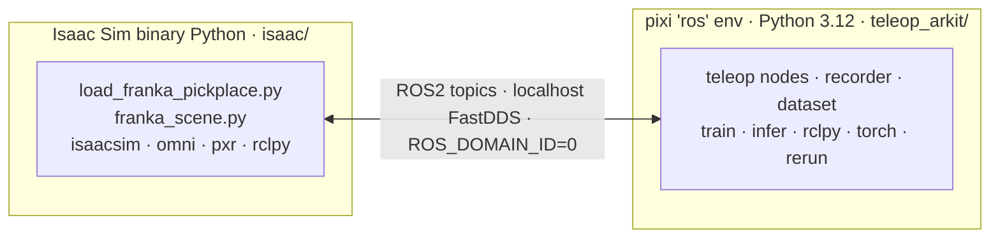
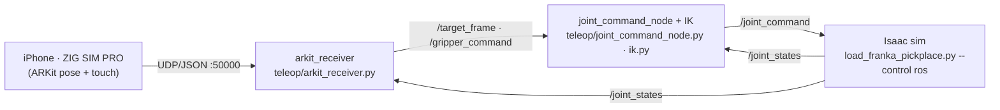
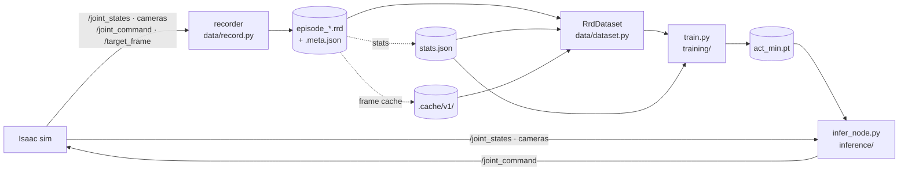
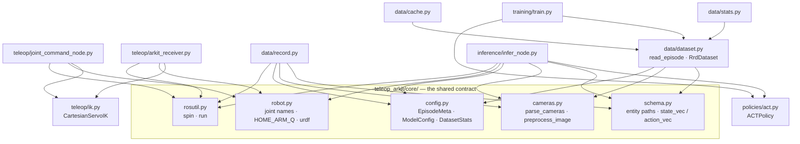
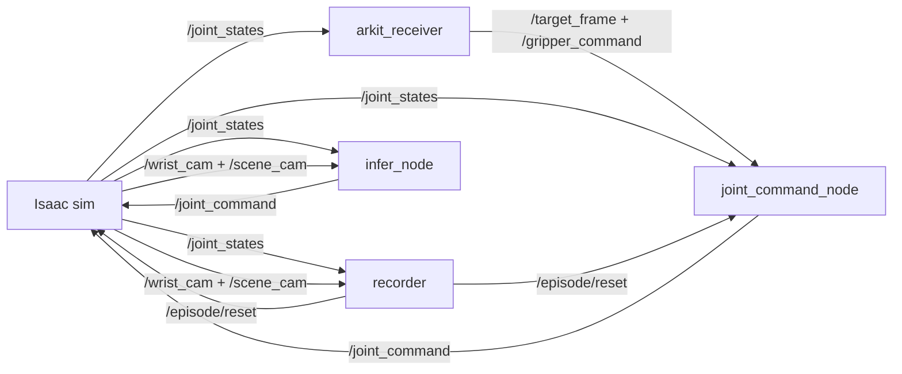
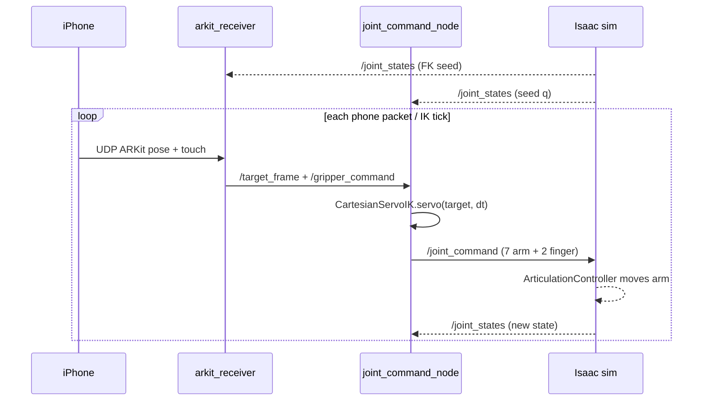
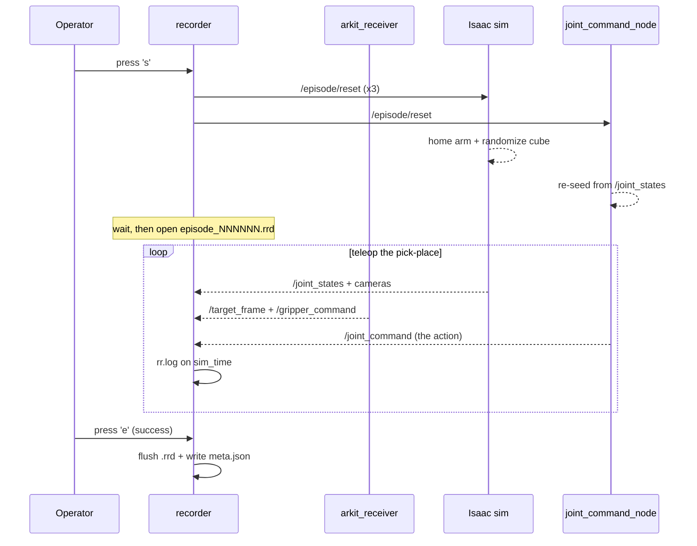
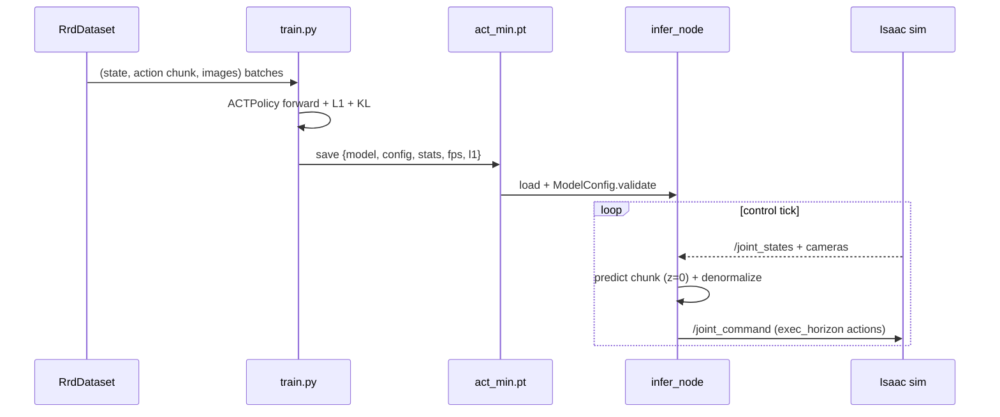

# Architecture & Code Flow — Franka × iPhone-ARKit Teleop + Imitation Learning

This is the **map**: what each file does, how the pieces connect at runtime, and a single
**step-by-step runbook** for the whole pipeline — load the sim, set up IK, set up ARKit, visualize
in Rerun, record, parse/normalize, train, and infer.

- **Why / history / decisions** → [PROJECT.md](../PROJECT.md) (the dated diary).
- **Fresh-machine setup + troubleshooting** → [HOWTO.md](HOWTO.md).
- **Per-directory contracts** → the `AGENTS.md` tree (`teleop_arkit/AGENTS.md`, `isaac/AGENTS.md`, …).
- Diagrams are **Mermaid** (renders inline on GitHub / VS Code). See [the note on diagrams](#a-note-on-diagrams) for why not Excalidraw.

---

## 1. The two runtimes (read this first — it's the #1 source of confusion)

The project spans **two separate Python runtimes that never import each other**. They communicate
**only over ROS2 topics** on localhost (FastDDS, `ROS_DOMAIN_ID=0`).



| | `isaac/` | `teleop_arkit/` |
|---|---|---|
| **Runtime** | Isaac Sim 6.0 binary's *bundled* Python | pixi `ros` env (RoboStack Jazzy, py3.12) |
| **Launched by** | `scripts/run_isaac.sh` → `pixi run franka*` (default env) | `pixi run -e ros <task>` |
| **Holds** | the simulated Franka, cameras, physics, the ROS2 bridge | IK, ARKit, recording, dataset, training, inference |
| **Can import** | `isaacsim`/`omni`/`pxr` — **NOT** `teleop_arkit` | `torch`/`rerun`/`pinocchio` — **NOT** `isaacsim` |

> They only ever touch through **topics**. If you're looking for a function call that crosses this
> line, there isn't one — look for a published/subscribed topic instead.

---

## 2. Two phases, one loop each

The project has two modes, and each is a closed loop through the Isaac sim:

- **Live teleop** — your phone drives the arm (Phases 4–6).
- **Imitation learning** — record teleop → train a policy → the *policy* drives the arm (Phase 7).

### 2a. Live teleop loop



### 2b. Imitation-learning pipeline



---

## 3. File / module map — who imports whom

Everything in `teleop_arkit/` imports the **shared contract** in `core/`. That is the hub that keeps
the writer (recorder), the reader (dataset), and the consumer (inference) from drifting.



| File | Role | Imports from `core/` | Entry point |
|---|---|---|---|
| `isaac/franka_scene.py` | sim **library**: scene/camera builders, ROS2 graph, `randomize_cube_pose`, `CUBE_SPAWN_REGION` | — (separate runtime) | (imported by the app) |
| `isaac/load_franka_pickplace.py` | sim **app**: args, run loops, `main`, `_ResetListener` | — | `pixi run franka` / `franka-teleop` |
| `teleop/ik.py` | `CartesianServoIK` — Pinocchio damped-least-squares servo | `robot` | `python -m teleop_arkit.teleop.ik` (self-test) |
| `teleop/joint_command_node.py` | `/target_frame` → IK → `/joint_command` | `robot`, `rosutil` | `ik-topic` / `ik-demo` |
| `teleop/arkit_receiver.py` | ZIG SIM UDP → `/target_frame` + `/gripper_command` | `robot`, `rosutil` | `arkit` |
| `teleop/robot_state_pub.py` | `/robot_description` + `/tf` for rviz | `robot` | `robot-model` |
| `teleop/sniff_stream.py` | raw ZIG SIM UDP printer (diagnostic) | — | `sniff` |
| `data/record.py` | `EpisodeRecorder` → one `.rrd` + `meta.json` per episode | `schema`, `cameras`, `config`, `rosutil` | `record` |
| `data/dataset.py` | `read_episode` + `RrdDataset` (align + chunk + decode) | `schema`, `cameras`, `config` | `eval-rrd` |
| `data/stats.py` | mean/std/min/max → `stats.json` | (via `dataset.read_episode`) | `stats` |
| `data/cache.py` | pre-decoded frame cache → `.cache/v1/` | (via `dataset`) | `cache` |
| `policies/` | `registry.build_model` (the model seam) + `base.Policy`; `act.py` (CVAE ACT ~11.6 M) and `diffusion.py` (in-house DDPM/DDIM Diffusion Policy) | `config` | (built via registry) |
| `training/train.py` | train/overfit loop (`--model act\|diffusion`) → ckpt | `dataset`, `policies.registry` | `train`/`smoke-act` · `train-dp`/`smoke-dp` |
| `inference/infer_node.py` | ckpt → `/joint_command` (closed-loop; auto-detects model) | `policies.registry`, `schema`, `cameras`, `robot`, `rosutil` | `infer` / `infer-dp` |

---

## 4. The ROS2 topic graph — how the processes connect

This is the actual "wiring" between the two runtimes. Every arrow is a topic.



| Topic | Msg type | Published by | Subscribed by |
|---|---|---|---|
| `/clock` | `rosgraph_msgs/Clock` | Isaac | recorder (sets `sim_time`) |
| `/joint_states` | `sensor_msgs/JointState` | Isaac | joint_command_node, arkit_receiver, recorder, infer_node |
| `/joint_command` | `sensor_msgs/JointState` | joint_command_node **or** infer_node | Isaac (`ArticulationController`); recorder (as the *action*) |
| `/target_frame` | `geometry_msgs/PoseStamped` | arkit_receiver | joint_command_node, recorder (auxiliary) |
| `/gripper_command` | `std_msgs/Float64` | arkit_receiver | joint_command_node, recorder |
| `/episode/reset` | `std_msgs/Empty` | recorder (×3) / the `reset` task (×5) | Isaac `_ResetListener`, joint_command_node |
| `/wrist_cam/image_raw` | `sensor_msgs/Image` (640×480) | Isaac | recorder, infer_node |
| `/scene_cam/image_raw` | `sensor_msgs/Image` (1280×720) | Isaac | recorder, infer_node |
| `/tf`, `/{cam}/camera_info` | tf2 / CameraInfo | Isaac | rviz / external |
| `/record/command` | `std_msgs/String` | (you, for automation) | recorder (`s`/`e`/`f`/`d`/`q`) |

> **Gotcha:** a single `/episode/reset` is dropped by a DDS discovery race — that's why the recorder
> publishes it 3× and the standalone `reset` task 5×.

---

## 5. The data contract — what's inside a `.rrd`

The recorder (`data/record.py`) **writes** these Rerun entities; the dataset (`data/dataset.py`)
**reads** them. Both use the exact strings in `core/schema.py` — change them in one place.

| Rerun entity | Rerun type | Source topic | From |
|---|---|---|---|
| `observation/state` | `Scalars` (8, or 16 with vel) | `/joint_states` | `schema.state_vec` |
| `action` | `Scalars` (8) | `/joint_command` | `schema.action_vec` |
| `action/gripper_command` | `Scalars` (1) | `/gripper_command` | |
| `action/target_pose` | `Transform3D` | `/target_frame` | auxiliary |
| `observation/images/<cam>` | `EncodedImage` (JPEG) | each camera | `schema.image_log` |

**Two timeline facts that trip people up:**
- The recorder logs **everything on the `sim_time` timeline** (from `/clock`), so streams share a clock.
- The dataset **aligns by latest-at on `log_time`** (Rerun's wall-clock stamp), **not** `sim_time` —
  because our ROS nodes wall-stamp `/joint_command`+`/target_frame` while Isaac sim-stamps the rest,
  making `sim_time` mixed-axis. The action label for grid point *t* is the **next-`chunk` window**.

A `RrdDataset[i]` sample:
```python
{
  "observation.state":            Tensor(state_dim,)        # 8, z-scored via stats.json
  "action":                       Tensor(chunk, action_dim) # (16, 8), z-scored
  "observation.images.<cam>":     Tensor(3, 224, 224)       # RGB, [0,1]  (one key per camera)
}
```

---

## 6. End-to-end runbook

Ordered exactly as you'd do it. Commands are pixi tasks (the stable surface). Three terminals:
**A** = Isaac (default env), **B/C…** = `ros` env.

> **"The model" is ambiguous in robotics + ML — this project has both:**
> the **robot/sim model** (the Franka — *loaded by launching Isaac*, Step 1) and the **ML policy**
> (ACT — *selected & trained*, Step 7). Steps below cover both at their place.

### Step 0 — Environments (once)
`pixi` provides two envs. Fresh machine? Do [HOWTO.md](HOWTO.md) first (driver, Isaac binary, `.isaac-sim` symlink).
```bash
pixi install            # default env (launches the Isaac binary)
pixi install -e ros     # RoboStack Jazzy + pinocchio + torch + rerun
```

### Step 1 — Load the model (launch the Franka in Isaac) · Terminal A
```bash
pixi run franka-teleop            # = load_franka_pickplace.py --control ros  (arm idle, follows /joint_command)
# headless (no Isaac GUI — you'll watch the cameras in Rerun instead, Step 4):
pixi run franka-teleop-headless
```
- **Files:** `isaac/load_franka_pickplace.py` → `isaac/franka_scene.py` (scene + cameras + ROS2 graph).
- **You should see:** RTX renderer init, the ROS2 graph built, and (in another terminal) `ros2 topic list` showing `/joint_states`, `/scene_cam/image_raw`, etc.
- **Gotcha:** needs a few GB VRAM — free the GPU first if Isaac OOMs (see HOWTO §8).
- *Optional* rviz robot model: `pixi run -e ros robot-model` (adds `/robot_description` + `/tf`).

### Step 2 — Set up the IK · Terminal B
```bash
pixi run -e ros ik-topic          # follow /target_frame -> IK -> /joint_command  (the teleop seam)
# phone-free sanity loop instead:  pixi run -e ros ik-demo
# pure-solver check (no ROS/Isaac):  pixi run -e ros python -m teleop_arkit.teleop.ik   # "reached in N steps"
```
- **Files:** `teleop/joint_command_node.py` + `teleop/ik.py` (`CartesianServoIK`).
- **You should see:** `seeded from /joint_states; start EE = [...]`. The arm now holds until a target arrives.

### Step 3 — Set up ARKit (the phone) · Terminal C
```bash
pixi run -e ros sniff             # confirm phone packets arrive first
pixi run -e ros arkit --scale 1.5 # ZIG SIM UDP -> /target_frame + /gripper_command
```
- **Phone:** ZIG SIM **PRO** (ARKit 6-DoF is a PRO feature). Enable data items **ARKit** *and* **touch**; protocol **UDP**, format **JSON**; destination = this PC's reachable IP (LAN `192.168.x.x` **or** Tailscale `100.x`), port **50000**. `sudo ufw allow 50000/udp` once.
- **Controls:** 1 finger = move (clutch, re-zeros on engage) · 0 fingers = freeze · 2-finger tap = toggle gripper.
- **You should see:** Terminal C logs `move engaged` on touch; the arm mirrors the phone.

### Step 4 — Visualize in Rerun (data + camera feeds)
**Live, while teleoping** — the recorder tees both camera feeds into the Rerun viewer (side-by-side blueprint), so you can teleop with **no Isaac GUI** (`franka-teleop-headless` in Step 1):
```bash
pixi run -e ros record --view --task "pick the cube and place it in the bin"
```
**Inspect a saved episode** (all streams + camera frames in the native viewer):
```bash
pixi run -e ros python -m rerun ~/rerun_episodes/episode_000000.rrd
```
- **Files:** `data/record.py` (`--view` → `rrb.Blueprint`); the viewer ships with `rerun-sdk`.

### Step 5 — Record demonstrations · Terminal C (replaces Step 4's `--view` command)
```bash
pixi run -e ros record --view --task "pick the cube and place it in the bin"
```
Per episode, type in the recorder terminal:

| Key | Action |
|---|---|
| `s` | **start** — publishes `/episode/reset` (homes arm + randomizes cube), waits `--settle-secs`, opens a new `.rrd` |
| `e` | **end + SUCCESS** — flush `.rrd`, write `meta.json` (`success=true`) |
| `f` | **end + FAILURE** — saved but **excluded from training** |
| `d` | discard · `q` quit · `h` help |

- **Output:** `~/rerun_episodes/episode_NNNNNN.rrd` + `.meta.json`.
- **Knobs for scale:** `--image-max-width 640 --jpeg-quality 80` (scene cam is 1280×720; you train at 224²).
- **Between manual runs** (no recorder): `pixi run -e ros reset` re-homes + randomizes (publishes ×5).

### Step 6 — Parse & normalize the data · `ros` env
```bash
pixi run -e ros eval-rrd          # read a .rrd back: prints sample shapes, decode throughput, a DataLoader batch
pixi run -e ros stats             # mean/std/min/max over state+action -> ~/rerun_episodes/stats.json
pixi run -e ros cache             # (scale-prep) pre-decoded frame cache -> ~/rerun_episodes/.cache/v1/
```
- **Files:** `data/dataset.py` (`read_episode` + `RrdDataset`), `data/stats.py`, `data/cache.py`.
- **eval-rrd is your data gate:** confirm `observation.state (8,)`, `action (16, 8)`, images `(3,224,224)`, and a healthy decode rate before training at scale.

### Step 7 — Select a model & train · `ros` env
Two baselines today, picked with `--model {act,diffusion}`; `policies/registry.build_model` builds the
chosen one and the ckpt records its `config` (Gemma VLA later — see `policies/AGENTS.md`).
```bash
# ACT (CVAE transformer):
pixi run -e ros smoke-act                 # 50 steps, 1 episode — finite loss = data+model wired
pixi run -e ros train --max-episodes 1    # OVERFIT one episode (the data-validation litmus)
pixi run -e ros train                     # full training over all success episodes
# Diffusion Policy (in-house DDPM/DDIM):
pixi run -e ros smoke-dp                  # 50-step sanity
pixi run -e ros train-dp                  # full training -> checkpoints/diffusion.pt
```
- **Files:** `training/train.py` → `policies/registry.py` → `policies/act.py` | `policies/diffusion.py`, + `data/dataset.py` + `stats.json`.
- **Output ckpt:** `checkpoints/act_min.pt` (ACT) or `diffusion.pt` (DP) = `{model, config, stats, fps, loss}` — `config` (incl. `name`) + `stats` are what inference replays for parity.

### Step 8 — Infer (closed-loop in sim)
```bash
# Terminal A:
pixi run franka-teleop
pixi run -e ros reset                      # re-home + randomize the cube to a start state
# Terminal B:
pixi run -e ros infer                      # loads act_min.pt -> /joint_command
```
- **Files:** `inference/infer_node.py` (validates `ckpt["config"]` via `ModelConfig`, mirrors `preprocess_image`, denormalizes with `ckpt["stats"]`).
- **`--exec-horizon`:** default `0` = run the **full chunk open-loop** then re-plan (correct for an absolute-position ACT). `--exec-horizon 1` (single-step receding) **stalls** because `action[0] ≈ current state`.

---

## 7. Sequence diagrams

### 7a. Live teleop loop


### 7b. Record an episode


### 7c. Train → infer


---

## 8. Quick reference — every entry point

| Task | Env | Module | Does |
|---|---|---|---|
| `franka` | default | `isaac/load_franka_pickplace.py` | pick-place scene (autonomous self-test) |
| `franka-teleop` | default | `… --control ros` | **the launch for recording AND inference** (arm follows `/joint_command`) |
| `franka-teleop-headless` | default | `… --control ros --headless` | same, no Isaac GUI (visualize in Rerun) |
| `ik-topic` / `ik-demo` | ros | `teleop.joint_command_node` | IK node (follow `/target_frame` / scripted) |
| `arkit` | ros | `teleop.arkit_receiver` | phone → `/target_frame` + `/gripper_command` |
| `robot-model` / `sniff` | ros | `teleop.robot_state_pub` / `sniff_stream` | rviz model / UDP packet sniffer |
| `record` | ros | `data.record` | record demos → `.rrd` + `meta.json` |
| `reset` | ros | (`ros2 topic pub` ×5) | re-home arm + randomize cube |
| `eval-rrd` / `stats` / `cache` | ros | `data.dataset` / `data.stats` / `data.cache` | read+verify / normalization / frame cache |
| `smoke-act`/`train` · `smoke-dp`/`train-dp` | ros | `training.train` | 50-step sanity / full train (ACT or Diffusion) |
| `infer` / `infer-dp` | ros | `inference.infer_node` | policy → `/joint_command` (closed-loop; model auto-detected from ckpt) |

---

## A note on diagrams

All diagrams here are **Mermaid**: they render inline on GitHub/VS Code, live in the markdown as
text (so they diff and stay in version control), and are trivial to keep current as the code changes
— which matters because the `AGENTS.md`/DOX rule is to keep docs current, not snapshot them.

**Excalidraw** was considered and not used: an `.excalidraw` scene is a JSON canvas that does **not**
render in markdown, can't be diffed meaningfully, and is hard to keep in sync with code. If you want
an editable hand-drawn canvas for a presentation, ask and I'll generate a `.excalidraw` file you can
open at excalidraw.com — but for an in-repo, maintained doc, Mermaid is the right tool.
